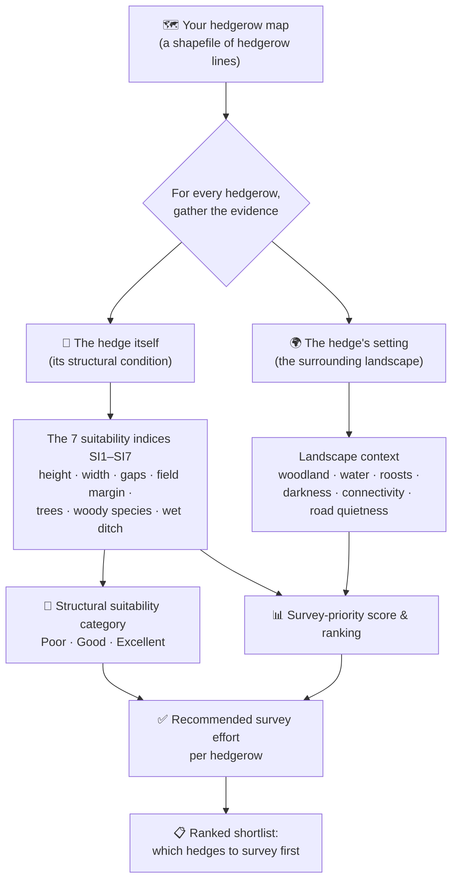
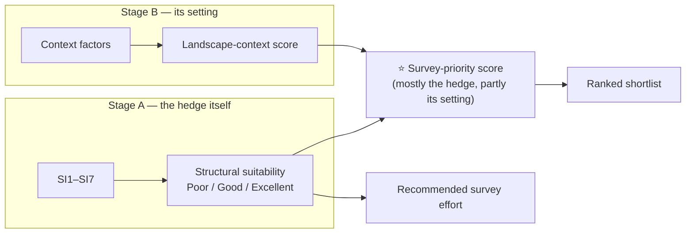
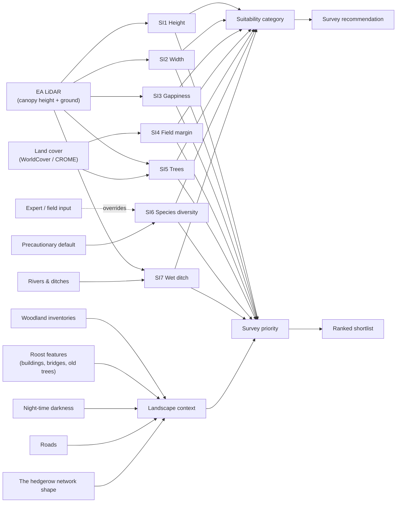
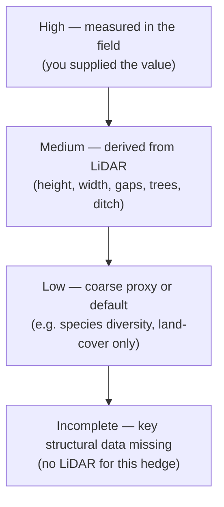
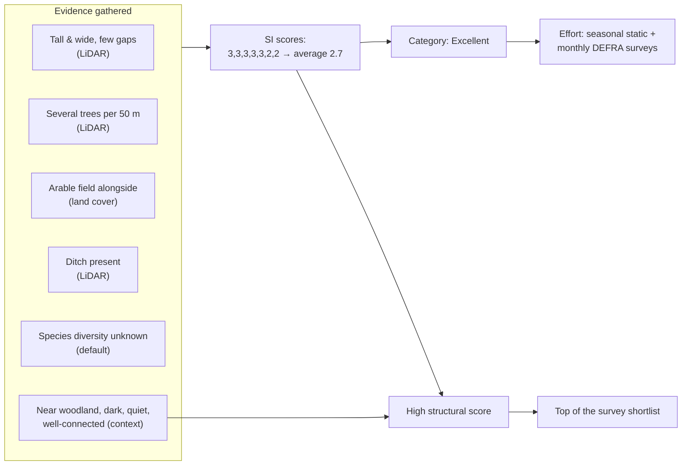
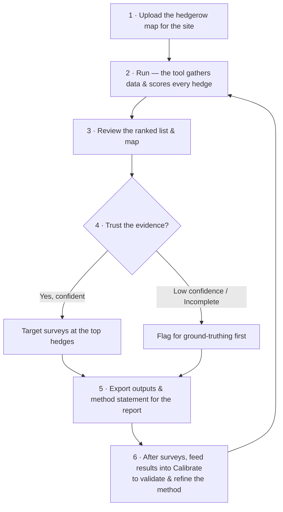

# How the Bat Hedgerow Suitability Tool Works — a guide for ecologists

This guide explains **what the tool does, why, and how to read its results** — in ecological,
decision-making terms rather than software terms. It answers the questions an ecologist actually
cares about: *what evidence goes in, what comes out, and why one hedgerow is prioritised over another.*

---

## 1. The decision this tool supports

On a large scheme you often **cannot survey every hedgerow** — there isn't the budget, the season, or
the access. You need a defensible way to say *"survey these hedges first, deprioritise those, and flag
the ones we couldn't assess."*

This tool does exactly that. You give it a map of hedgerows; it scores each one for **how suitable it
is as bat habitat** and returns a **ranked shortlist** for static detector surveys, with a transparent
reason for every score.

> ⚠️ **Suitability is not activity.** A high score means a hedge is a higher *priority to survey* — not
> that bats are definitely present. The output supports professional judgement; it does not replace it.

---

## 2. The whole tool in one picture

**Read it as a sentence:** *for every hedgerow, the tool looks at the hedge itself and its surroundings,
turns that evidence into the seven suitability indices plus a landscape-context score, and combines them
into a category, a priority ranking, and a recommended level of survey effort.*

---

## 3. What goes in, what comes out

| You provide | The tool produces |
|---|---|
| A hedgerow layer (shapefile / GeoPackage / GeoJSON of **lines**) for an **England** site | A **ranked list** of hedgerows by survey priority |
| *(optional)* any field measurements you already have, as attributes | A **suitability category** per hedge: Poor / Good / Excellent / Incomplete |
| *(optional)* survey activity data, to validate the scores | A **recommended survey effort** per hedge |
| | A **map** coloured by category or by confidence |
| | A **per-hedge explanation** (which factors drove its score) |
| | Downloadable **GeoPackage / Shapefile / CSV** and a **method statement** for the report |

Everything else — the habitat, terrain, woodland, roads and roost data — the tool **fetches and prepares
itself** for your area. You don't assemble GIS layers by hand.

---

## 4. How the hedge itself is judged — the seven suitability indices

These are the **WSP / HyNet hedgerow suitability indices (SI1–SI7)**. Each one captures a different way a
hedgerow matters to bats. The tool derives each remotely, but you can override any of them with a real
field measurement.

| Index | What it measures | Why it matters to bats | Score bands |
|---|---|---|---|
| **SI1 Height** | How tall the hedge is | Taller hedges give shelter and a stronger commuting/foraging edge | >2 m = 3 · 1–2 m = 2 · <1 m = 1 |
| **SI2 Width** | How wide the hedge is | Wider hedges = more cover, more insects, better corridor | >1.5 m = 3 · 1–1.5 m = 2 · <1 m = 1 |
| **SI3 Gappiness** | Gaps along the hedge | Continuity matters — bats avoid crossing gaps; a broken hedge is a poor corridor | <10% = 3 · 10–20% = 2 · >20% = 1 |
| **SI4 Arable field margin** | Uncultivated strip beside the hedge | A margin buffers the hedge and supports foraging insects | >5 m = 4 · 2–5 m = 3 · <2 m = 2 · none = 1 |
| **SI5 Trees present** | Mature trees along the hedge (per 50 m) | Trees mean roost features, structural complexity and more prey | >6 = 4 · 3–6 = 3 · 1–2 = 2 · none = 1 |
| **SI6 Woody species diversity** | Number of woody species (per 20 m) | More plant diversity → more diverse insect prey | >7 = 3 · 4–6 = 2 · <3 = 1 |
| **SI7 Wet ditch** | A wet ditch beside the hedge | Water boosts insect abundance and bat activity | present = 2 · absent = 1 |

The seven scores are **averaged** into a single suitability value, which sets the category:

> **Poor** (< 1.70)  ·  **Good** (1.70 – 2.39)  ·  **Excellent** (≥ 2.40)

This category is **purely about the hedge's structure** — exactly the WSP method — so it is defensible and
easy to explain to a client.

---

## 5. The hedge's setting — the landscape-context layer

Two hedges can be structurally identical but very different in value depending on **where they sit**. The
tool adds a separate **landscape-context** layer, each factor scored from 0 (poor) to 1 (excellent for bats):

| Context factor | What it asks | Why it matters |
|---|---|---|
| **Woodland proximity** | Is there woodland nearby? | Woodland is a roost and foraging source; hedges linking to it are more valuable |
| **Water proximity** | Is there a watercourse nearby? | Water concentrates insects and bat foraging |
| **Connectivity** | Is the hedge a key link in the network? | Well-connected hedges are the commuting "motorways" between roosts and feeding areas |
| **Roost potential** | Are buildings, bridges or veteran trees nearby? | Proximity to roost features raises the chance of bat use |
| **Darkness** | How dark is the corridor? | Most UK bats avoid light; dark hedges are far more usable |
| **Road quietness** | How far from busy roads? | Roads sever corridors and add collision risk |

Crucially, this context **does not change the structural category** — it refines the **survey-priority ranking**.

---

## 6. From evidence to a priority — the two stages

By default the priority is **structure-led** (the hedge's own condition counts for about two-thirds, its
setting for about one-third). An ecologist can change this balance, or the weight of any single factor, in
the fine-tuning panel — but the **defaults are sensible**, so most users never need to.

**Category → recommended survey effort:**

| Category | What it means | Recommended effort |
|---|---|---|
| **Excellent** | High structural suitability | Seasonal automated static **plus** monthly modified DEFRA local-level surveys |
| **Good** | Moderate suitability | Seasonal automated static detector survey |
| **Poor** | Low suitability | No further survey |
| **Incomplete** | Not enough evidence to classify | Field verification required before effort is reduced |

---

## 7. Which data produces which output

This is the heart of explainability: **every score traces back to a specific evidence source.**

**In words — what each dataset is *for*:**

| Evidence source | What it answers | Feeds |
|---|---|---|
| **EA LiDAR** (height model of canopy and ground) | How tall/wide/continuous is the hedge? How many trees? Is there a ditch? | SI1, SI2, SI3, SI5, SI7 |
| **Land cover** (WorldCover, Crop Map of England) | Is the adjacent field arable? Is there tree cover? | SI4, SI5 (backup) |
| **Rivers / watercourses** | Is there water beside the hedge? | SI7 (backup), water context |
| **Woodland inventories** (Priority Habitats, Ancient Woodland, Living England) | Is woodland nearby? | Woodland context |
| **Roost features** (buildings, bridges, veteran trees) | Are roost opportunities nearby? | Roost context |
| **Night-time darkness** | Is the corridor dark? | Darkness context |
| **Roads** | Is it away from busy roads? | Road-quietness context |
| **The hedgerow map itself** | Is this hedge a key link in the network? | Connectivity context |
| **Your field data** *(optional)* | Anything you measured on the ground | Overrides the matching index |

The one index that **cannot be measured remotely is SI6 (woody species diversity)** — you cannot count
plant species from above. The tool gives it a cautious middle value and flags it as low confidence, unless
you supply a field count. This is deliberate and honest, exactly as the WSP method advises.

---

## 8. How much can you trust each result?

Every index carries a **confidence flag**, and each hedge gets an overall one:

- **Field-measured** values always win and are marked High.
- **LiDAR-derived** structure is Medium — good enough to rank, worth ground-truthing for material decisions.
- **Default / coarse** signals (notably species diversity) are Low — treat with caution.
- If the structural data is missing for a hedge, the category is **Incomplete** and the tool says *field
  verification required* rather than pretending to know.

This means **data gaps are shown, not hidden** — you can filter to "only confident hedges", or "everything
that still needs ground-truthing", before making decisions.

---

## 9. Reading the outputs

- **Ranked table** — every hedge with its priority rank, category, the seven SI scores, confidence, and the
  recommended survey effort. Sort or filter by any of these (e.g. *"show me only Excellent, high-confidence
  hedges"*, or *"rank by tree cover"*).
- **Map** — hedges coloured by **category** (how suitable) or by **confidence** (how sure we are), with the
  full breakdown on hover.
- **Explain** — pick any hedge and see **exactly which factors drove its score**: a bar for each index and
  context factor, summing to the final priority. It also shows which settings the ranking is most sensitive
  to — so you can see *why* this hedge ranks where it does.
- **Calibrate** — if you have real survey results (e.g. **crossing-point counts**), upload them and the tool
  reports how well its scores match observed activity, and can suggest re-tuned weights. This is how the
  method gets **validated and improved** over time.
- **Downloads & method statement** — GIS outputs plus a written, client-ready explanation of the method,
  data sources and limitations.

---

## 10. A worked example

Take one hedgerow:

**Cause and effect:** a tall, continuous, tree-rich hedge beside arable land with a ditch scores Excellent
on structure; because it is also near woodland, dark and well-connected, it rises to the **top of the
shortlist**, and the tool recommends the highest survey effort. If, instead, the same hedge were short,
gappy, beside a lit dual carriageway and isolated, it would fall to **Poor / deprioritise**.

---

## 11. What the tool is — and is not

- ✅ It is a **transparent, evidence-based prioritisation aid**: every score is traceable to data and can be
  defended in a report.
- ✅ It is **honest about uncertainty**: proxy-derived and missing values are flagged, not buried.
- ✅ It is **tunable** by an ecologist, with sensible defaults.
- ❌ It does **not** confirm bat presence or absence, or measure activity.
- ❌ It does **not** replace field survey, ground-truthing, or professional judgement.
- ❌ Remote estimates (especially species diversity, and anything without LiDAR) should be **verified where
  they materially affect a decision**.

Use it to **target effort and justify decisions** — *"we surveyed these hedges first because…"* — not to
draw final ecological conclusions on its own.

---

## 12. How an ecologist uses it, step by step

That final loop is the point: the tool gives a **defensible starting shortlist now**, and gets **more
trustworthy each time real survey data is fed back in**.
